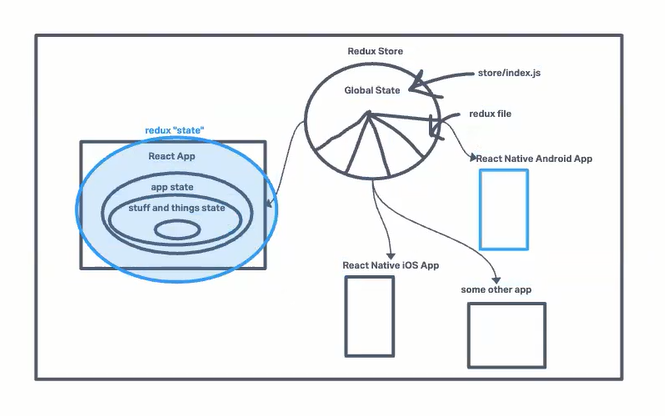
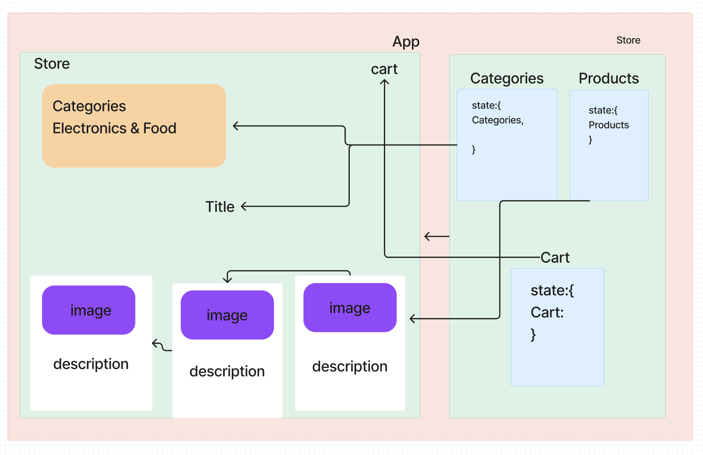

# Combined Reducers## LAB - Class 37
### Author: Coriana Williams

### Problem Domain# Phase 1 Requirements
Virtual Store Phase 1: For this assignment, you will be starting the process of creating an e-Commerce storefront using React with Redux, coupled with your live API server.

Phase 2 Requirements
Continue work on the e-Commerce storefront, breaking up the store into multiple reducers and sharing functionality/data between components.

Phase 3 Requirements

Phase 4 Requirements

### Links and Resources
- ![Sandbox URL1 - class 36](https://codesandbox.io/p/github/Coriana1/storefront/main?layout=%257B%2522sidebarPanel%2522%253A%2522EXPLORER%2522%252C%2522rootPanelGroup%2522%253A%257B%2522direction%2522%253A%2522horizontal%2522%252C%2522contentType%2522%253A%2522UNKNOWN%2522%252C%2522type%2522%253A%2522PANEL_GROUP%2522%252C%2522id%2522%253A%2522ROOT_LAYOUT%2522%252C%2522panels%2522%253A%255B%257B%2522type%2522%253A%2522PANEL_GROUP%2522%252C%2522contentType%2522%253A%2522UNKNOWN%2522%252C%2522direction%2522%253A%2522vertical%2522%252C%2522id%2522%253A%2522cljyiur9u000g3b6m59e3x2sy%2522%252C%2522sizes%2522%253A%255B70%252C30%255D%252C%2522panels%2522%253A%255B%257B%2522type%2522%253A%2522PANEL_GROUP%2522%252C%2522contentType%2522%253A%2522EDITOR%2522%252C%2522direction%2522%253A%2522horizontal%2522%252C%2522id%2522%253A%2522EDITOR%2522%252C%2522panels%2522%253A%255B%257B%2522type%2522%253A%2522PANEL%2522%252C%2522contentType%2522%253A%2522EDITOR%2522%252C%2522id%2522%253A%2522cljyiur9u000b3b6m6zsnwlm4%2522%257D%255D%252C%2522sizes%2522%253A%255B100%255D%257D%252C%257B%2522type%2522%253A%2522PANEL_GROUP%2522%252C%2522contentType%2522%253A%2522SHELLS%2522%252C%2522direction%2522%253A%2522horizontal%2522%252C%2522id%2522%253A%2522SHELLS%2522%252C%2522panels%2522%253A%255B%257B%2522type%2522%253A%2522PANEL%2522%252C%2522contentType%2522%253A%2522SHELLS%2522%252C%2522id%2522%253A%2522cljyiur9u000f3b6me2wg73gm%2522%257D%255D%252C%2522sizes%2522%253A%255B100%255D%257D%255D%257D%252C%257B%2522type%2522%253A%2522PANEL_GROUP%2522%252C%2522contentType%2522%253A%2522DEVTOOLS%2522%252C%2522direction%2522%253A%2522vertical%2522%252C%2522id%2522%253A%2522DEVTOOLS%2522%252C%2522panels%2522%253A%255B%257B%2522type%2522%253A%2522PANEL%2522%252C%2522contentType%2522%253A%2522DEVTOOLS%2522%252C%2522id%2522%253A%2522cljyiur9u000d3b6mdn43fbvd%2522%257D%255D%252C%2522sizes%2522%253A%255B100%255D%257D%255D%252C%2522sizes%2522%253A%255B50%252C50%255D%257D%252C%2522tabbedPanels%2522%253A%257B%2522cljyiur9u000b3b6m6zsnwlm4%2522%253A%257B%2522tabs%2522%253A%255B%257B%2522id%2522%253A%2522cljyiur9t000a3b6mkm945xz0%2522%252C%2522mode%2522%253A%2522permanent%2522%252C%2522type%2522%253A%2522FILE%2522%252C%2522filepath%2522%253A%2522%252Fsrc%252FApp.jsx%2522%252C%2522state%2522%253A%2522IDLE%2522%257D%255D%252C%2522id%2522%253A%2522cljyiur9u000b3b6m6zsnwlm4%2522%252C%2522activeTabId%2522%253A%2522cljyiur9t000a3b6mkm945xz0%2522%257D%252C%2522cljyiur9u000d3b6mdn43fbvd%2522%253A%257B%2522id%2522%253A%2522cljyiur9u000d3b6mdn43fbvd%2522%252C%2522tabs%2522%253A%255B%255D%257D%252C%2522cljyiur9u000f3b6me2wg73gm%2522%253A%257B%2522id%2522%253A%2522cljyiur9u000f3b6me2wg73gm%2522%252C%2522activeTabId%2522%253A%2522cljyiyllk00oo3b6mnbo0hpis%2522%252C%2522tabs%2522%253A%255B%257B%2522id%2522%253A%2522cljyiur9u000e3b6m6d595h05%2522%252C%2522mode%2522%253A%2522permanent%2522%252C%2522type%2522%253A%2522TERMINAL%2522%252C%2522shellId%2522%253A%2522cljyiurd7001bfvel2dbv5m25%2522%257D%252C%257B%2522type%2522%253A%2522TASK_LOG%2522%252C%2522taskId%2522%253A%2522dev%2522%252C%2522id%2522%253A%2522cljyiyllk00oo3b6mnbo0hpis%2522%252C%2522mode%2522%253A%2522permanent%2522%257D%255D%257D%257D%252C%2522showDevtools%2522%253Atrue%252C%2522showShells%2522%253Atrue%252C%2522showSidebar%2522%253Atrue%252C%2522sidebarPanelSize%2522%253A15%257D)

- ![Sandbox URL2 - class 37](https://codesandbox.io/p/github/Coriana1/storefront/main?layout=%257B%2522sidebarPanel%2522%253A%2522EXPLORER%2522%252C%2522rootPanelGroup%2522%253A%257B%2522direction%2522%253A%2522horizontal%2522%252C%2522contentType%2522%253A%2522UNKNOWN%2522%252C%2522type%2522%253A%2522PANEL_GROUP%2522%252C%2522id%2522%253A%2522ROOT_LAYOUT%2522%252C%2522panels%2522%253A%255B%257B%2522type%2522%253A%2522PANEL_GROUP%2522%252C%2522contentType%2522%253A%2522UNKNOWN%2522%252C%2522direction%2522%253A%2522vertical%2522%252C%2522id%2522%253A%2522cljyiur9u000g3b6m59e3x2sy%2522%252C%2522sizes%2522%253A%255B70%252C30%255D%252C%2522panels%2522%253A%255B%257B%2522type%2522%253A%2522PANEL_GROUP%2522%252C%2522contentType%2522%253A%2522EDITOR%2522%252C%2522direction%2522%253A%2522horizontal%2522%252C%2522id%2522%253A%2522EDITOR%2522%252C%2522panels%2522%253A%255B%257B%2522type%2522%253A%2522PANEL%2522%252C%2522contentType%2522%253A%2522EDITOR%2522%252C%2522id%2522%253A%2522cljyiur9u000b3b6m6zsnwlm4%2522%257D%255D%252C%2522sizes%2522%253A%255B100%255D%257D%252C%257B%2522type%2522%253A%2522PANEL_GROUP%2522%252C%2522contentType%2522%253A%2522SHELLS%2522%252C%2522direction%2522%253A%2522horizontal%2522%252C%2522id%2522%253A%2522SHELLS%2522%252C%2522panels%2522%253A%255B%257B%2522type%2522%253A%2522PANEL%2522%252C%2522contentType%2522%253A%2522SHELLS%2522%252C%2522id%2522%253A%2522cljyiur9u000f3b6me2wg73gm%2522%257D%255D%252C%2522sizes%2522%253A%255B100%255D%257D%255D%257D%252C%257B%2522type%2522%253A%2522PANEL_GROUP%2522%252C%2522contentType%2522%253A%2522DEVTOOLS%2522%252C%2522direction%2522%253A%2522vertical%2522%252C%2522id%2522%253A%2522DEVTOOLS%2522%252C%2522panels%2522%253A%255B%257B%2522type%2522%253A%2522PANEL%2522%252C%2522contentType%2522%253A%2522DEVTOOLS%2522%252C%2522id%2522%253A%2522cljyiur9u000d3b6mdn43fbvd%2522%257D%255D%252C%2522sizes%2522%253A%255B100%255D%257D%255D%252C%2522sizes%2522%253A%255B50%252C50%255D%257D%252C%2522tabbedPanels%2522%253A%257B%2522cljyiur9u000b3b6m6zsnwlm4%2522%253A%257B%2522id%2522%253A%2522cljyiur9u000b3b6m6zsnwlm4%2522%252C%2522activeTabId%2522%253A%2522cljyncr0z00so3b6madzg990e%2522%252C%2522tabs%2522%253A%255B%257B%2522id%2522%253A%2522cljyiur9t000a3b6mkm945xz0%2522%252C%2522mode%2522%253A%2522permanent%2522%252C%2522type%2522%253A%2522FILE%2522%252C%2522filepath%2522%253A%2522%252Fsrc%252FApp.jsx%2522%252C%2522state%2522%253A%2522IDLE%2522%257D%252C%257B%2522type%2522%253A%2522FILE%2522%252C%2522filepath%2522%253A%2522%252F.codesandbox%252Ftasks.json%2522%252C%2522id%2522%253A%2522cljyncr0z00so3b6madzg990e%2522%252C%2522mode%2522%253A%2522permanent%2522%257D%255D%257D%252C%2522cljyiur9u000d3b6mdn43fbvd%2522%253A%257B%2522id%2522%253A%2522cljyiur9u000d3b6mdn43fbvd%2522%252C%2522tabs%2522%253A%255B%257B%2522type%2522%253A%2522TASK_PORT%2522%252C%2522taskId%2522%253A%2522dev%2522%252C%2522port%2522%253A5173%252C%2522id%2522%253A%2522cljymht5l036x3b6mau0mwlqx%2522%252C%2522mode%2522%253A%2522permanent%2522%252C%2522path%2522%253A%2522%252F%2522%257D%255D%252C%2522activeTabId%2522%253A%2522cljymht5l036x3b6mau0mwlqx%2522%257D%252C%2522cljyiur9u000f3b6me2wg73gm%2522%253A%257B%2522id%2522%253A%2522cljyiur9u000f3b6me2wg73gm%2522%252C%2522activeTabId%2522%253A%2522cljyne0a001cs3b6mqxehygrz%2522%252C%2522tabs%2522%253A%255B%257B%2522id%2522%253A%2522cljyiur9u000e3b6m6d595h05%2522%252C%2522mode%2522%253A%2522permanent%2522%252C%2522type%2522%253A%2522TERMINAL%2522%252C%2522shellId%2522%253A%2522cljyndpj8002wfvel5sn2bgyz%2522%257D%252C%257B%2522type%2522%253A%2522TASK_LOG%2522%252C%2522taskId%2522%253A%2522dev%2522%252C%2522id%2522%253A%2522cljyne0a001cs3b6mqxehygrz%2522%252C%2522mode%2522%253A%2522permanent%2522%257D%255D%257D%257D%252C%2522showDevtools%2522%253Atrue%252C%2522showShells%2522%253Atrue%252C%2522showSidebar%2522%253Atrue%252C%2522sidebarPanelSize%2522%253A15%257D)

- 

- 

- 
## Collaborators
Kenya Womack

### Setup

#### `.env` requirements (where applicable)
for now I have none and do not require one

#### How to initialize/run your application (where applicable)
- e.g. `npm run dev`

#### Tests
- npm test

#### UML

